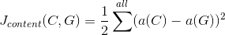
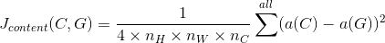
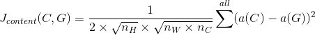

# Neural-Style-Transfer

This is a Tensorflow implementation of styling images using VGG-19 model.

## Some Examples

| Content Image                                                | Style Image                                                    | Generated Image                                                                        |
|:------------------------------------------------------------:|:--------------------------------------------------------------:|:--------------------------------------------------------------------------------------:|
|         |  |        |
|  |             |            |
|  |  |  |

## Hyperparamter Tuning

### Style Strength

| Alpha | Beta |   Result                                                          |
|:-----:|:----:|:-----------------------------------------------------------------:|
| 0.025 |   5  |  |
|   1   |  500 |  |
|   5   |  100 |  |
|   10  |  40  |  |
|  7.5  |  100 |  |
|   10  | 5000 |  |

### Content Formula

Here, 

Jcontent is the content loss function  
C and G represent content and generated image respectively  
a(C)and a(G) are the activations from the chosen layer when image is passed to the model  
nH, nW, nC are the height, weight and number of channels of the image respectively

|                Formula Used           |                           Generated Image(Run only upto 100 iterations)   |
|:-------------------------------------:|:-------------------------------------------------------------------------:|
|   |   |
|  |  |
|   |   |

## References:

1. [A Neural Algorithm of Artistic Style](https://arxiv.org/abs/1508.06576)
2. [Convolutional Neural Networks](https://www.coursera.org/learn/convolutional-neural-networks/) by deeplearning.ai on coursera
3. [NeuralArt Github Repository](https://github.com/ckmarkoh/neuralart_tensorflow)
